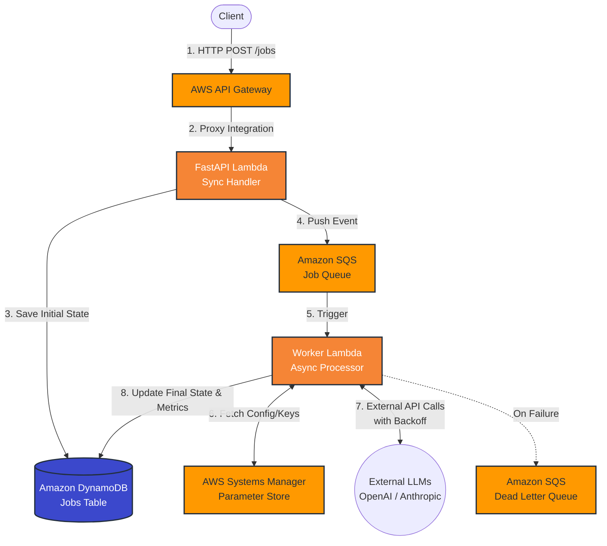

# OrchestraAI 🎼

**A Resilient, Serverless Multi-Model AI Orchestration Pipeline**

OrchestraAI is a multi-tenant, asynchronous API built to reliably process massive text extraction and AI batch jobs without blocking synchronous API threads. It acts as an abstraction and orchestration layer over external LLM providers (OpenAI, Anthropic), handling their inherent latency, strict rate limits, and intermittent timeouts gracefully.

This project demonstrates **production-grade backend and platform engineering patterns**—focusing on decoupling, resiliency, distributed tracing, Infrastructure as Code (IaC), and strict failure handling. It is designed to bridge the gap between simple API wrappers and resilient, distributed AI platforms capable of scaling safely.

---

## 🏗️ Architecture & System Design

Synchronously calling LLMs from an API introduces severe vulnerability to traffic spikes, upstream timeouts, and dropped connections. OrchestraAI solves this by implementing an asynchronous, queue-based worker pattern.

### The Request Lifecycle
1. **Ingestion**: Client requests are authenticated and routed via AWS API Gateway to a FastAPI handler running on an AWS Lambda function.
2. **State & Queuing**: The API synchronously generates a job state in DynamoDB, enqueues the payload into an SQS Queue, and immediately returns a `202 Accepted` with a `job_id`.
3. **Async Processing**: SQS triggers a fleet of Worker Lambdas. These workers handle the heavy lifting: fetching secrets, orchestrating external AI APIs, parsing results, and managing retries.
4. **Completion**: The worker updates the DynamoDB record with the final AI output and usage metrics, making it available for client polling or webhook dispatch.

### Architecture Diagram



---

## ⚙️ Core Engineering Principles

This system is engineered for production-grade reliability, addressing the failure modes commonly ignored in basic "AI wrapper" applications.

### 1. Idempotency 
Network interruptions can lead to duplicate client requests. To prevent processing identical LLM payloads multiple times, the ingestion API implements standard HTTP idempotency via the `X-Idempotency-Key` header, backed by a DynamoDB Global Secondary Index.

### 2. Distributed Tracing & Observability
The API layer utilizes Python `contextvars` to safely generate and propagate `X-Correlation-ID`s across asynchronous event-loop boundaries. This ID is passed into the SQS payload, injected into all CloudWatch logs, and permanently attached to the job record in DynamoDB for end-to-end request tracing.

### 3. Dynamic Rate-Limiting & Exponential Backoff
External AI APIs enforce strict Token Per Minute (TPM) limits. When the Worker Lambda encounters an `HTTP 429 Too Many Requests` response, it calculates an exponential backoff (`$60s \times 10^{n-1}`) using the SQS `ApproximateReceiveCount`. It then explicitly extends the SQS message visibility timeout to delay the retry, acting as a dynamic pressure valve for the architecture.

### 4. SQS Partial Batch Failures
To maximize throughput, the SQS-Lambda trigger processes messages in batches of 5. If a single message fails, the worker catches the error and utilizes the AWS `batchItemFailures` response format to ensure only the failed message is retried, preventing successful messages from being wastefully reprocessed.

### 5. Dependency Inversion & Secrets Management
The core processing logic depends on an abstract `AIProvider` interface, allowing the system to instantly swap between Gemini, Claude, or OpenAI models via an `AIServiceFactory`. API keys are fetched at runtime from **AWS Systems Manager (SSM) Parameter Store** (`SecureString`) and cached globally within the Lambda execution context to eliminate network latency on warm starts.

### 6. Infrastructure as Code (IaC) & Least Privilege
The entire AWS footprint is codified using **Terraform**. IAM roles are strictly scoped following the principle of least privilege. For example, the API Lambda can only `PutItem` and `SendMessage`—it has no permissions to read SQS queues or delete tables.

---

## 🗂️ Project Structure

```text
/
├── .github/workflows/       # CI/CD pipelines for linting, testing, and Terraform deployment
├── src/
│   ├── app/                 # FastAPI synchronous API logic (Mangum entrypoint)
│   └── workers/             # Asynchronous SQS consumer logic & AI provider abstractions
├── terraform/               # Modular IaC for AWS infrastructure
│   ├── modules/             # Segregated config for api_gateway, compute, database, and queue
│   └── main.tf              # Root orchestration
└── tests/                   # Pytest suite with mocked AWS/LLM responses
```

---

## 🧪 Automated Testing

The `pytest` suite utilizes `moto` to mock AWS services locally, allowing for rapid execution without cloud dependencies or costs. Key behaviors tested include:
1. **Idempotency Verification**: Validating that duplicate keys result in a single SQS message enqueue.
2. **Backoff Verification**: Proving that `429` errors correctly mutate SQS message visibility timeouts according to the exponential backoff formula.

---

## 🚀 CI/CD Pipeline (GitHub Actions)

OrchestraAI utilizes a fully automated, OIDC-secured CI/CD pipeline via GitHub Actions.

1. **Security & Quality**: On every PR, the pipeline runs `black` formatting, `flake8` linting, and executes the `pytest` suite. It also runs `tfsec` to statically analyze the Terraform code for cloud security vulnerabilities.
2. **Secure AWS Authentication**: The pipeline uses OpenID Connect (OIDC) to temporarily assume an explicitly scoped AWS IAM role, avoiding the use of long-lived static credentials.
3. **Continuous Deployment**: Upon merging to `main`, the pipeline packages the Python code natively for `manylinux2014_x86_64` (Amazon Linux), synthesizes the Terraform plan, and deploys the infrastructure and Lambda code to the live AWS environment.
